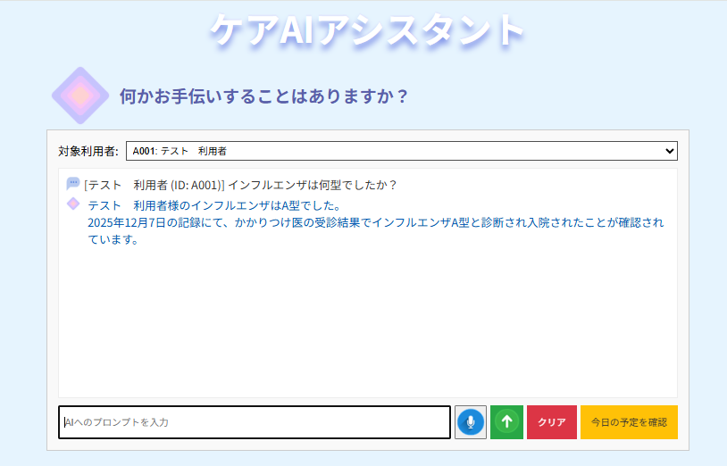
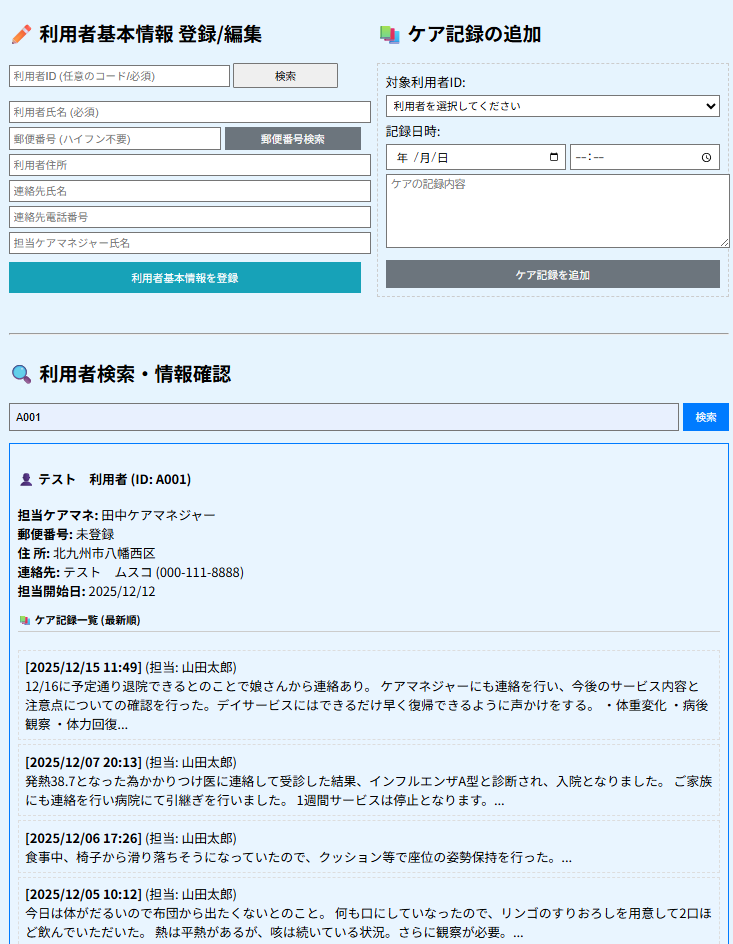

## 1.LPのタイトル
ケアAIアシスタント

## 2.制作LPの説明（40文字程度）
https://kadai05-api-9c95b.web.app

Geminiと郵便番号API連携を行い事業企画に近いものを作成した

(事業企画)介護ケア記録についてAIアシスタントが必要な支援回答を行う

Geminiと連携させ質問するとケア記録のデータから回答する

Geminiの回答の元となるケア記録のデータ登録の為に「利用者登録」「ケア記録」が登録できるようにした

利用者の登録の際に「zipcloud」のAPI連携で郵便番号から住所を取得できるようにした

## 3.工夫した点・こだわった点 
・Geminiにプロンプトを指定してそれらしい回答になるようにした

・登録したケア記録データの一覧が確認できるようにした

## 4.次回トライしたこと（または機能）
・cssの整理までたどり着けなかった

・本日の予定が未実装なので、動くようにする

・過去のケア記録が表示されない場合があるので解決できるようにする

・AIのプロンプトの変更を試す

・音声返答について確認する

## 5.備考（感想、シェアしたいこと等なんでも） 
・今回GeminiAPI連携でNodeのインストールを行い、デプロイを経験(理解できていませんが)

・無償だとGoogle Cloudのプロジェクト側の使用制限があり、1日のリクエスト制限（Limit: 20）を超えると翌日までテストできないことを知った

FunctionsがFirestoreからデータを取得した後、Gemini APIに回答生成を依頼する際に、無料枠で設定されている1日のリクエスト制限

（クォータ）を超過すると致命的なエラー（500 Internal Server Error）をフロントエンドに返している。

・Google Cloud ConsoleでGemini APIのクォータ制限を引き上げるか要検討。

・Google Cloud Consoleで詳細なエラーログが確認できたので原因を特定できた